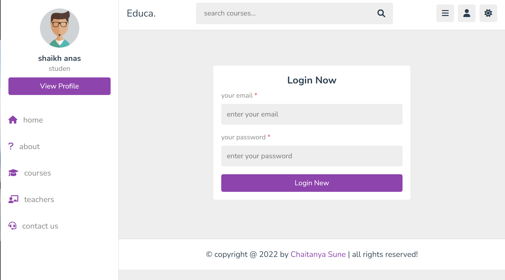
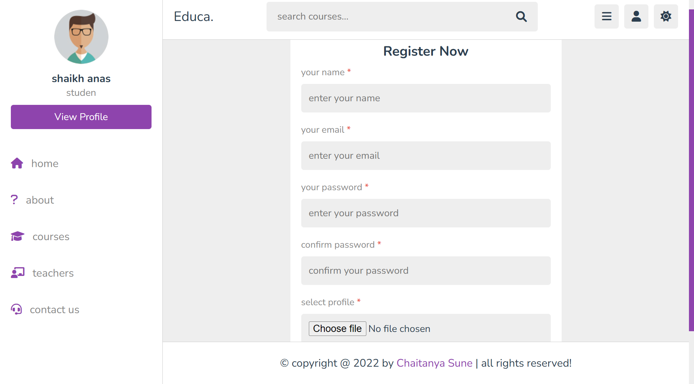
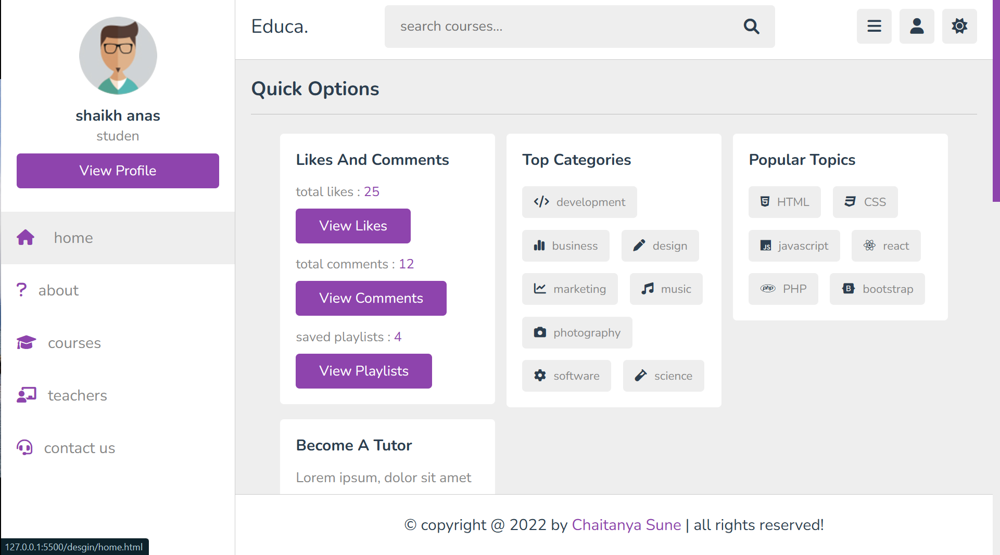
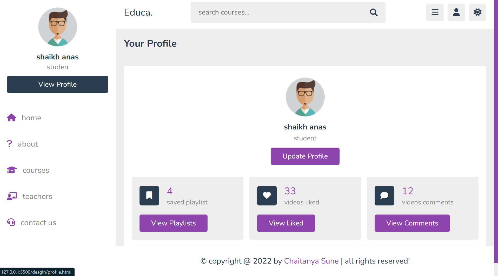
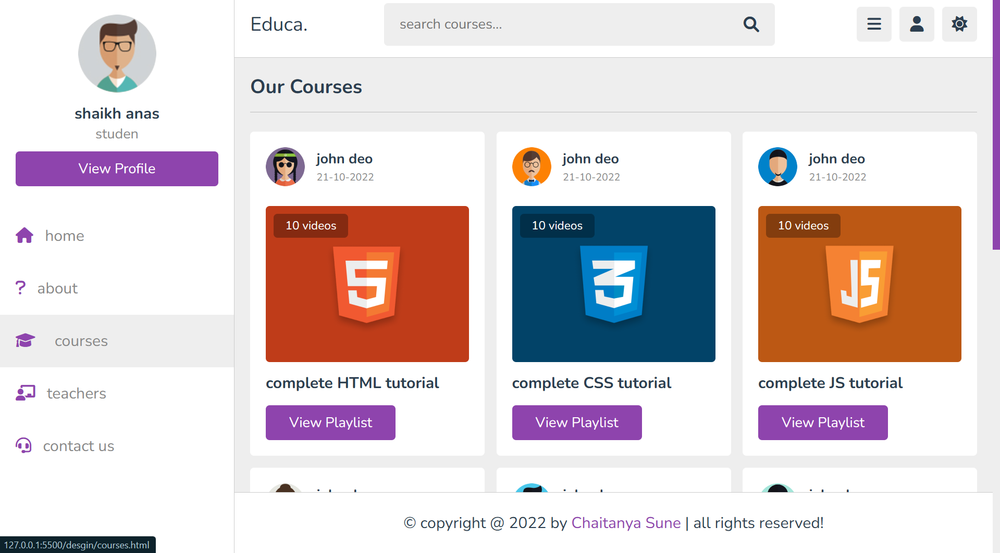
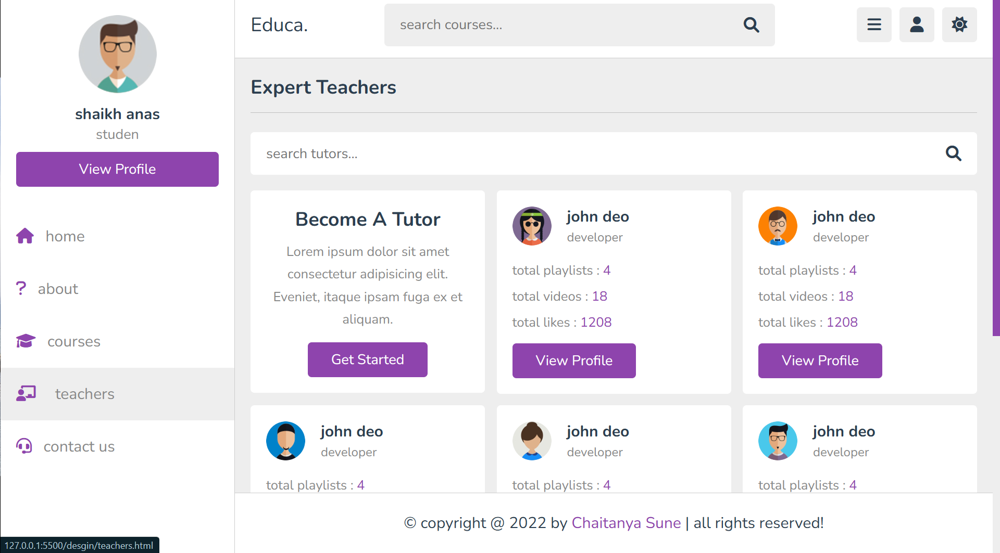

# Online Course Website

## Project Description
This project is a simple Online Course Website built using HTML and CSS. The website provides a user-friendly interface where visitors can browse various online courses, read course descriptions, and explore different sections such as About Us, Contact, and more. It's designed to be responsive and visually appealing across different devices.

## Table of Contents
- [Features](#Features)
- [Technologies Used](#Technologies-Used)
- [How to Use](#How-to-Use)
- [Screenshots](#Screenshots)

## Features
- **Responsive Design:** The website layout adjusts seamlessly for desktop, tablet, and mobile devices.
- **Home Page:** Introduction to the website, highlighting popular courses.
- **Course Listings:** Displays a grid of available courses with brief descriptions.
- **About Us:** Information about the platform and its goals.
- **Contact Page:** Simple contact form for users to get in touch.

## Technologies Used
- **HTML5:** For structuring the content of the website.
- **CSS3:** For styling and layout, including flexbox and media queries to ensure responsiveness.

## How to Use
- Clone or download this repository.
- Open the index.html file in any web browser.
- Navigate through the website using the menu links.

## Screenshots
### Login Page

### Register Page

### Home Page

### Profile Page

### About Page

### Courses Page

### Teachers Page

### Contact Us Page

# Preview Link
You can view a live demo of the website by clicking the link below:
Preview Link ->
